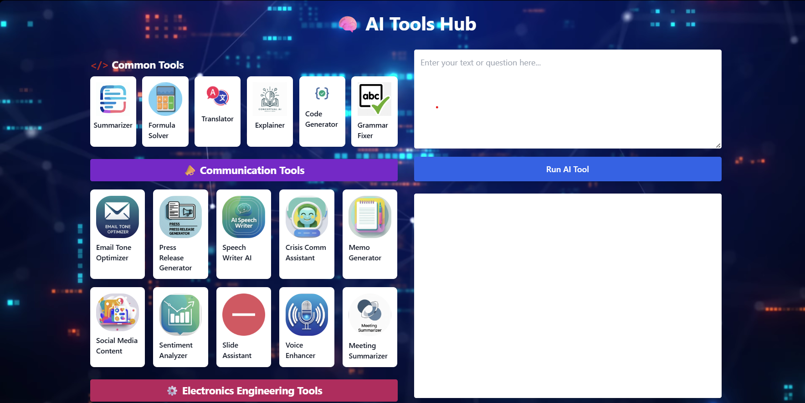

# AI Tools Website

A sleek, simple front-end interface showcasing a collection of AI-powered tools designed to enhance productivity and communication.

## 🚀 Features

- Clean and interactive user interface
- Collection of thumbnails for each AI tool
- Easy-to-navigate HTML layout
- Local runner script for quick launch

## 📂 Project Structure

```
AI-tools-website-main/
├── index.html               # Main HTML page
├── style.js                 # JavaScript for site behavior
├── runner.bat               # Batch file to launch site in browser
├── img.png, img2.png        # Interface screenshots
├── thumbnails/              # Thumbnails for various tools
├── how to run.txt           # Original run instructions
├── ideas.txt                # Tool ideas and notes
├── LICENSE                  # License information
```

## 🧑‍💻 Getting Started

### Prerequisites
- A modern web browser (Chrome, Firefox, Edge, etc.)
- Windows OS (for `runner.bat`) or manual method for other OS

### 🚦 Run the Website

#### On Windows:
1. Download or clone the repository
2. Double-click `runner.bat`
3. Your default browser will open the website

#### On macOS/Linux:
1. Open a terminal
2. Navigate to the project folder
3. Run:
```bash
open index.html         # On macOS
xdg-open index.html     # On Linux
```

## 🖼 Screenshots

### Homepage Interface


### Tool Preview


## 📝 License
This project is licensed under the MIT License. See the `LICENSE` file for more details.

## 🤝 Contributing
Pull requests and suggestions are welcome! Feel free to fork the repo and make improvements.

---

Built for showcasing AI productivity tools in a clean, accessible format.
